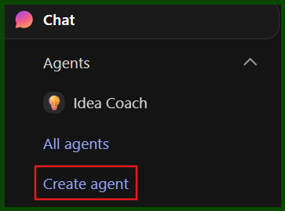
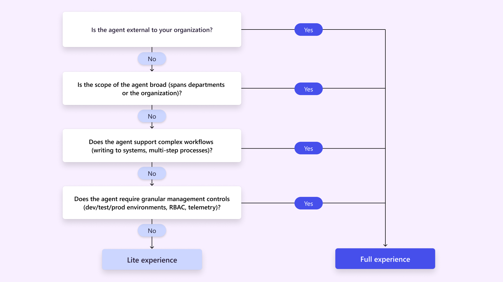
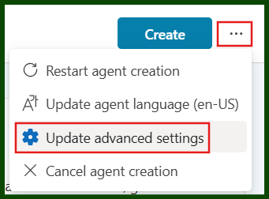
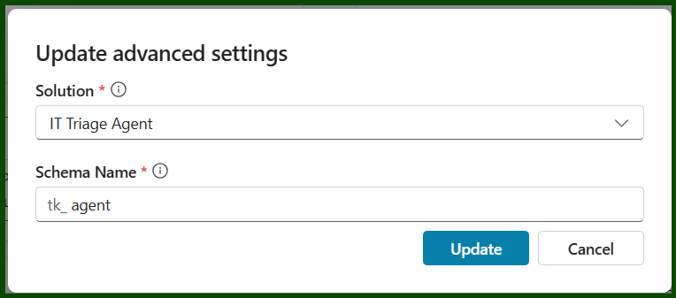

- Protects your data so that information from your chat does not get exposed to the public. 

# Choosing the right Copilot Studio
There are *currently* two way to build Copilot Agents:
1. Copilot Studio Lite - Integrated into the copilot chat, used for simple tasks and smaller teams.
 

2. Copilot Studio Full - A standalone app for larger teams and more complex requirements. 

Deciding which version you need can be helped with the following workflow provided by Microsoft. 

More details for each can be found in the documentation . 

Since our agent will be used by a larger audience and have potential for more complex workflow, we will be using the full version. 

# Getting Started
- Navigate to https://copilotstudio.preview.microsoft.com/ to get started
  - A Copilot Studio license is required for using this product. 
  
# Create your agent
When creating your agent for the first time, be sure to specify the specific environment. By default agents are created in your default tenant environment. 

We then have a couple of ways to begin creating our agent:
- **Pre-defined template** - This will give us some interesting looking templates that will likely be added to over time such as, Weather, Website Q&A, even a IT Helpdesk. All worth a look to see how they are made up.
- **Describe** - This will enable you to simply describe the agent that you want, and the AI will help you build it. Which is how we will be starting our agent creation. 

## Describing Your Agent
As with all prompting, this is an important step that should not be sped through. Let us take a moment to plan out exactly what we want out of our agent by answering the following:

**Purpose and Scope**
- What is the end goal we are trying to achieve? 
  - *E.g. Enable users to troubleshoot their own problems, taking some workload off the IT Team.*
- Who is using this solution? 
  - *E.g. Regular users, assumed low technical knowledge and no IT privileges.*
- Who is not using this solution? 
  - *E.g. IT members.*

**Agent Behaviour & Interaction Design**
- How would I want the agent to behave? 
  - *E.g. Polite, non-judgemental recommendations, straight to the point whilst being empathetic to the problem. Ask what steps the user has tried, gather error messages, assess urgency and impact, and explain how it reached its conclusion.*
- What kind of information should the agent collect from the users? 
  - *E.g. Computer name, error messages, steps already taken, impact on work, impact on others.*
- What kind of responses should the agent avoid? 
  - *E.g. Overly technical wording, vague recommendations without step-by-step guidance.*

**Inputs & Knowledge Sources**
- What would common inputs to this solution be? 
  - *E.g. File and folder access issues, browser caching issues, Wi-Fi issues, software issues, potentially faulty hardware.*
- Where would I want to get the knowledge for these solutions from? 
  - *E.g. Company repository of troubleshooting resolutions and procedure documents.*

**Escalation & Failure Handling**
- What if the issue cannot be resolved? 
  - *E.g. Escalate by creating a ticket for the problem, query the user for impact and urgency.*
- When should the agent escalate? 
  - *E.g. When the issue is unresolved after guided steps, or when impact/urgency is high.*
- What is the agent’s fallback plan, should it not resolve the problem? 
  - *E.g. Provide a summary of attempted steps and escalate with full context.*
**Completion Criteria & Follow-up**
- What is the definition of done? 
  - *E.g. User confirms the issue is resolved.*
- Are there any follow-up actions after completion? 
  - *E.g. User survey for effectiveness, input ticket as completed for tracking.*
**Usage Channels**
- How will users use the solution? 
  - *E.g. Teams, web portal, email.*
**Logging & Audit**
- What should the agent log and where? 
  - *E.g. Log user inputs, troubleshooting steps, resolution status in ticketing system or audit trail.*

After answering the above, we should now have a pretty clear vision of what we want this agent to be. With the help of copilot, I recommend putting your answers into . 

This inclues identifying:
1. Objective
2. Response rules
3. Workflow - split into steps with its goal, action, transition.
4. Output formatting - what to use/avoid
5. Examples - both valid and invalid

Remembering the following for a more effective prompt:
- Use markdown for better clarity and structure
- Use clear and actionable language - e.g. ask.., search.., send..
- Provide examples to prevent ambiguity
- Reference knowledge sources directly

## Configuring your agent
After prompting the agent, we should have a pretty good starting place for further tweaking and configuring. Making sure to double check the following:
- **Description** - Should highlight the tasks that the agent can handle and the support it offers to the user. 
- **Instructions** - This decides exactly how the agent is going to behave, and should therefore be detailed with the above rules in mind. 
- **Knowledge**
- **Solution** - If you haven't already, make sure that your agent will be created in a new solution.
  -  
  -  

## Testing and Deploying
As with anything else, this should have proper governance and be tested in a test environment and deployed across a pipeline. Last thing we want is our agent immediately being published into production, for it to be reciting reddit comments back to our users.

## Document it
Yes, the fun part may be over for the most part - but you know this is still important. Take the time to write some documentation on the agent, how it functions.

## Review it 
Pop something in your calendar (or whatever task tracking method you use) to come back and review how the agent is doing. This might be running a survey of the users, looking at usage metrics or chatting to a group anecdotally. At the end of the day, it's got your name on it and you want to make sure it is meeting the goal you set out to achieve.